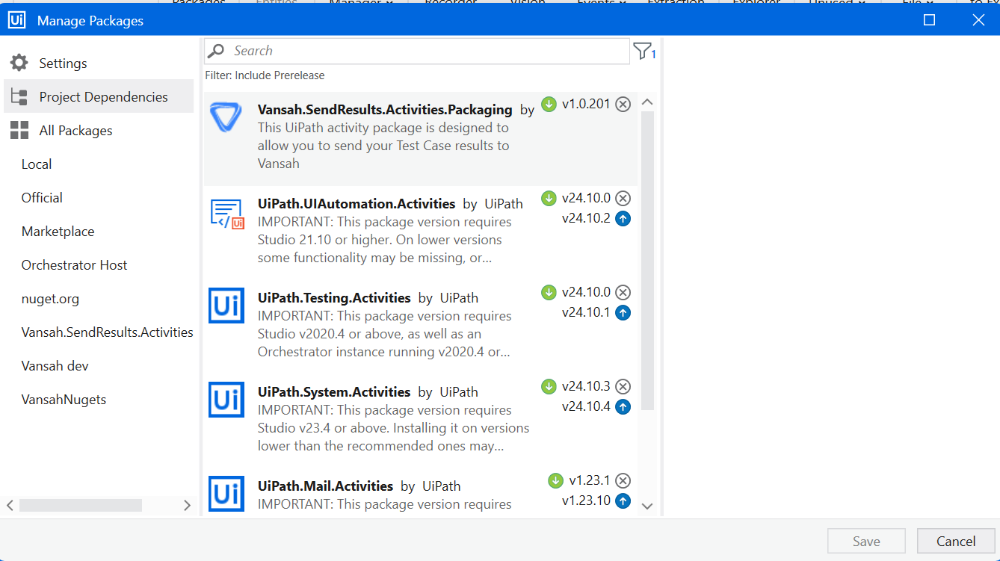

# UiPath with Vansah Sample Process

This Sample UiPath process opens up [Vansah.com](https://vansah.com/) in Chrome browser and proceeds to Book A Demo page to select a particular timeslot for demo and  simultaneously logs the test result in Vansah Test Management App.

### Prerequisites

 
-  UiPath Extension is installed in your Chrome browser.

     

 ## Step-by-Step Instructions for execution

- Download the [UiPath with Vansah Sample Process](https://github.com/testpointcorp/uipath-with-vansah.git) to your system
- Open `Main.xaml` with UiPath Studio.
-  Install the latest version of [Vansah.SendResults.Activities](https://github.com/testpointcorp/Vansah.SendResults.Activities) in your UiPath Process via **Manage Packages**.
     
     
     - Or Get it [here](https://www.nuget.org/packages/Vansah.SendResults.Activities/).
- Locate `Send Results to Vansah` activity in the sequence.
  
  
- Update the following fields in the activity.

    1. **Asset Key**: The Jira Issue Key or Test Folder ID. ( "Test-6" or "b97fe80b-0b6a-11ee-8e52-5658ef8eadd5")
    2. **Test Case Key**: The Vansah Test Case Key (e.g., "TEST-C1").
    3. **Test Result**: The result of the test (e.g., "Passed" or "Failed").
    4. Set **Operation** status to `Activate` in **Properties**.
    
   

       
- Provide the following optional fields if required in the 'Properties'. 

  1. **Environment**: Specify the environment (e.g., "DEV", "STAGING", "PROD").
  2. **Sprint Name**: The Jira Sprint Name (e.g., "Sprint 1", "Sprint June").
  3. **Version**: The Jira Version (e.g., "0.0.1", "March_Release").

- Vansah Configuration.

  - **API URL**: Leave blank to use the default API URL.
  > [!NOTE]
  > If your Jira instance is set to a specific location, the URL will be different. Update the URL by verifying it in the Vansah API Tokens section.
  - **Token**: Leave blank to use the environment variable option to store the token with the name `VANSAH_TOKEN`, or provide your token directly here.
  > [!Note]
  > Using environment variables in your system is more secure than providing sensitive information directly in your Activity.

- Execute Main.xaml file and verify whether the results are logged in Vansah Test Management app from the Output Console.
 

## Troubleshooting

- Ensure all required fields are filled out correctly.
- Verify the format of the `Test Case Key` and `Asset Key`.
- Make sure the `Test Result` is either **Passed** or **Failed**.
- If there are issues with the authentication, check the `Token` and `API URL` if they are customized.

You will now be able to run your process and send the  test results of your to Vansah using the `Vansah.SendResults.Activity` in UiPath successfully. Make sure to configure all required parameters accurately and refer to the Vansah documentation for additional details if necessary.
