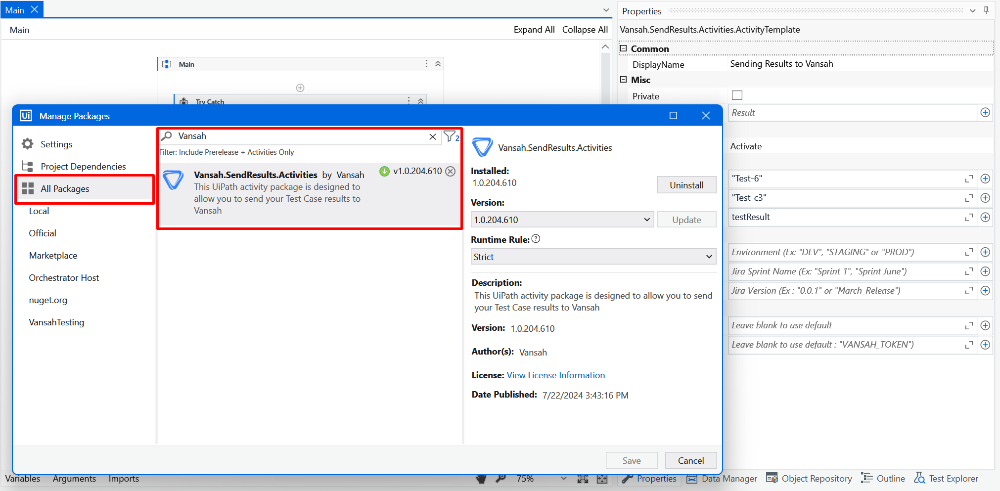

## UiPath Integration with Vansah Test Management for Jira

This guide demonstrates the process of integrating Vansah into your basic workflow in UiPath Studio. 

In this example, a browser is launched to navigate to [Vansah.com](https://vansah.com/), proceed to the Book A Demo page to select a specific timeslot for a demo, and concurrently log the test result in the Vansah Test Management App.

### Prerequisites
- UiPath Studio is installed.
- UiPath Extension is installed in your Chrome browser.
- [`Vansah`](https://marketplace.atlassian.com/apps/1224250/vansah-test-management-for-jira?tab=overview&hosting=cloud) is installed in your Jira workspace.
- Vansah [`Connect`](https://docs.vansah.com/docs-base/generate-a-vansah-api-token-from-jira-cloud/) token is obtained and stored in the Environment variable named: `VANSAH_TOKEN`

 ### Step-by-Step Instructions for execution
 
 1. Download project from [this](https://github.com/testpointcorp/uipath-with-vansah/) repo or Open your Existing Process in UIPath Studio.

  
    
 2. In order to send results to Vansah, we need to download Vansah Send Results Activity from `Manage Packages`.
  
  
 
 3. Search `Vansah` activity and add it to your Sequence .

  

  > Note :  Use Try, Catch and finally block to send results to Vansah on failure of your sequence. 

 4.Update Vansah Configuration.

  - **API URL**: Leave blank to use the default API URL.
  > Note :
  > If your Jira instance is set to a specific location, the URL will be different. Update the URL by verifying it in the Vansah API Tokens section.
  - **Token**: Leave blank to use the environment variable option to store the token with the name `VANSAH_TOKEN`, or provide your token directly here.
  > Note :
  > Using environment variables in your system is more secure than providing sensitive information directly in your Activity.
 
   

   
 5. Update the following fields in the activity.
    1. **Asset Key**: The Jira Issue Key or Test Folder ID. ( "Test-6" or "b97fe80b-0b6a-11ee-8e52-5658ef8eadd5")
    2. **Test Case Key**: The Vansah Test Case Key (e.g., "TEST-C1").
    3. **Test Result**: The result of the test (e.g., "Passed" or "Failed").
    4. Set **Operation** status to `Activate` in **Properties**.
    
   
 
 6. Provide the following optional fields if required in the 'Properties'.

   
  
 7. Execute Main.xaml file and verify whether the results are logged in Vansah Test Management app from the Output Console.

   

## Troubleshooting

- Ensure all required fields are filled out correctly.
- Make sure to set the Operation field as Activate.
- Verify the format of the `Test Case Key` and `Asset Key`.
- Make sure the `Test Result` is either "Passed" or "Failed".
- If there are issues with the authentication, check the `Token` and `API URL` if they are customized.

You will now be able to run your process and send the  test results of your to Vansah using the `Vansah.SendResults.Activity` in UiPath successfully. Make sure to configure all required parameters accurately and refer to the Vansah documentation for additional details if necessary.
